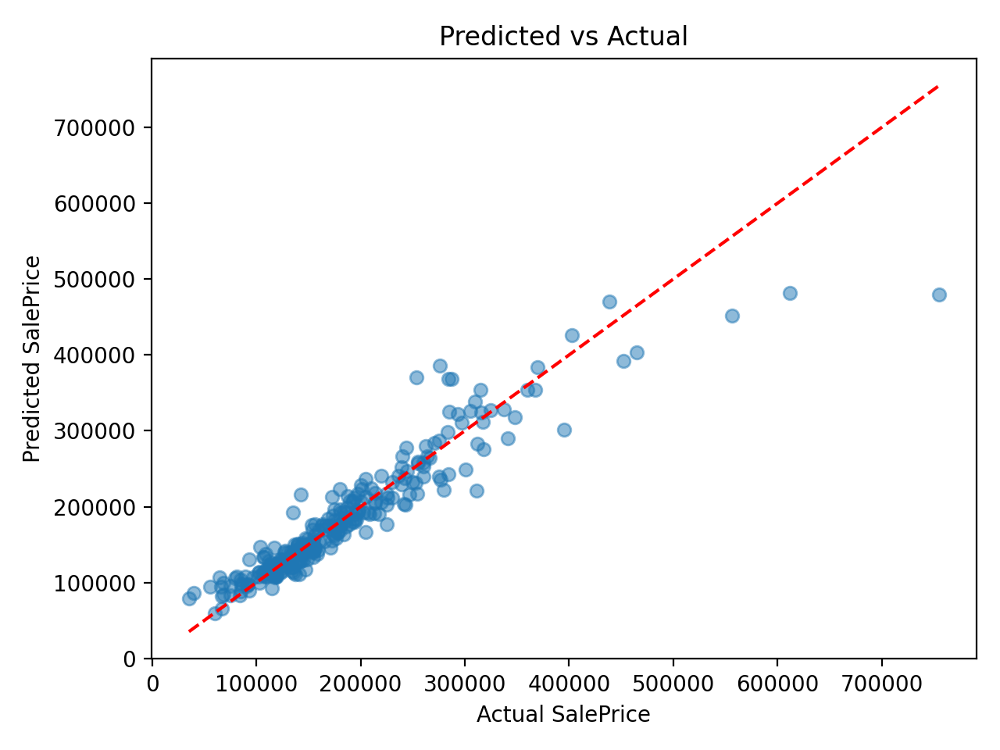
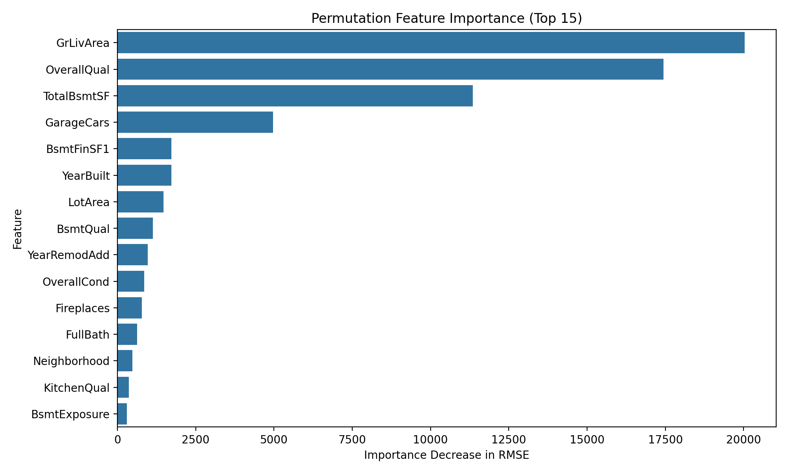
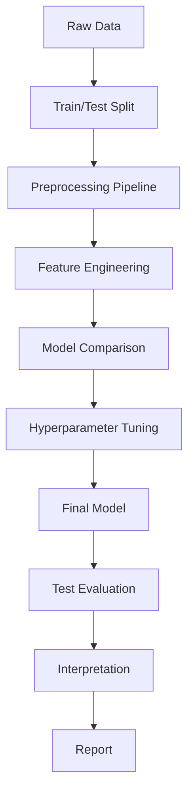

# Supervised Learning Model Implementation

This project implements an end-to-end supervised learning regression pipeline to predict housing prices using the Ames Housing dataset. It covers data ingestion, rigorous preprocessing, domain-driven feature engineering, cross-validation, hyperparameter tuning, and final evaluation.

## Problem Statement and Goal

The goal is to accurately predict the continuous target variable `SalePrice` for homes in Ames, Iowa based on various characteristics. This is a regression problem. The success metric is Root Mean Squared Error (RMSE).

## Dataset

- **Name**: Ames Housing Dataset
- **Source**: OpenML (ID 42165) via scikit-learn
- **Size**: 1460 rows, 80 features
- **Features**: Mix of numeric (e.g., GrLivArea, TotalBsmtSF) and categorical (e.g., Neighborhood, OverallQual) variables.

## Key Results

- Baseline (DummyRegressor) RMSE: ~79k
- Final Tuned Model RMSE: ~29k
- Test MAE: ~17k
- Test R2: ~0.89




## Architecture




### Modules
- `src/data.py`: Loads the OpenML dataset and splits into train/test sets.
- `src/features.py`: Encapsulates feature engineering and builds the preprocessing pipeline (imputation, scaling, one-hot encoding).
- `src/models.py`: Defines the models (Dummy, Ridge, Random Forest, HistGradientBoosting) in scikit-learn pipelines.
- `src/evaluate.py`: Handles cross-validation, grid search tuning, and test set evaluation.
- `src/plots.py`: Generates all visualizations.
- `src/run.py`: The main orchestration script that ties the modules together.
- `src/make_report.py`: Programmatically generates the DOCX report.

## Project Structure

```text
├── data/
├── docs/
├── figures/
├── models/
├── notebooks/
│   └── model_building.ipynb
├── report/
├── results/
├── src/
│   ├── data.py
│   ├── features.py
│   ├── models.py
│   ├── evaluate.py
│   ├── plots.py
│   ├── run.py
│   └── make_report.py
├── README.md
├── requirements.txt
└── .gitignore
```

## Installation

Requires Python 3.10+.
```bash
python -m venv venv
venv\Scripts\activate
pip install -r requirements.txt
```

## How to Run

Execute the main pipeline:
```bash
python src/run.py
```

Generate the report:
```bash
python src/make_report.py
```

To view the notebook:
```bash
jupyter notebook notebooks/model_building.ipynb
```

## Methodology Summary
- **Split**: 80/20 train/test split before any processing.
- **Pipelines**: Scikit-learn ColumnTransformer for imputing (median/constant) and encoding (StandardScaler/OneHotEncoder).
- **Feature Engineering**: Created HouseAge, RemodAge, and TotalSF based on domain logic.
- **Models**: Compared Dummy, Ridge, RandomForest, and HistGradientBoosting using 5-fold CV.
- **Validation**: Tuned the best model using GridSearchCV.

## Strengths, Limitations and Future Work
- **Strengths**: Robust to data leakage, handles missing values gracefully, captures non-linear trends.
- **Limitations**: Struggles with extreme outliers (very expensive homes). High cardinality in categorical features creates a sparse matrix.
- **Future Work**: Target log transformation, advanced feature selection, and collecting more data on luxury homes.

## Credits
- Dataset: Ames Housing Dataset (De Cock, 2011).
- License: MIT
- Author: [Your Name]
